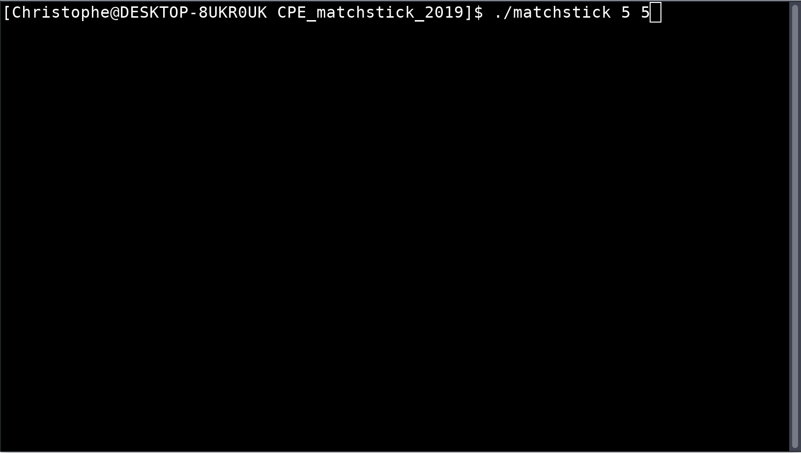

# Matchstick
Marienbad game against an AI

Project made in __C__.

## Introduction
### Usage
__./matchstick [Number of lines] [Max matchstick removed per turn]__
### Rules
 * The first argument (number of lines) will be greater than 1 and under 100.
 * The two players take turns; each player can, on a same line, take one or several matchsticks. 
 * The losing player is the one to take the last matchstick. 

## Demonstration

## Author
 * Christophe Sourinthone
 
## License
This project is licensed under the BSD 2-Clause "Simplified" License - see the LICENSE.md file for details 
